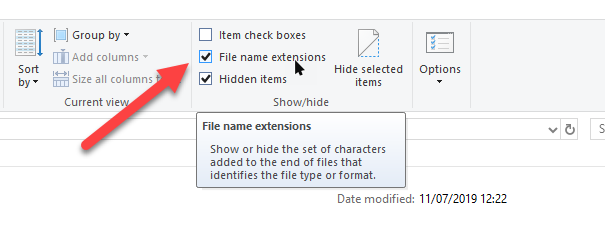

## 1.1 Requirements

- [Skyrim Special Edition](http://store.steampowered.com/app/489830/The_Elder_Scrolls_V_Skyrim_Special_Edition/) from Steam (updated to the latest version)
- a legit Windows 7 / 8 / 8.1 / 10 installation (64bit)
- editing software such as [Notepad++](https://notepad-plus-plus.org/) (recommended Freeware)
- an archiving tool like [7zip](http://www.7-zip.org/download.html) or [WinRAR](https://www.win-rar.com/start.html?&L=0)
- the latest drivers for your GPU ([NVIDIA](http://www.nvidia.com/Download/index.aspx) or [AMD](https://support.amd.com/en-us/download))

## 1.2 Show File Extension

By default file extensions - like EXE, PNG or ESP - are hidden in the Windows Explorer. Since it's fairly important to be able to see them during the installation of the guide, I recommend double-checking that you have file extensions set to visible.

- Open the Windows Explorer.
- Click the **View** tab at the top.
- Make sure **File name extensions** is checked.

---

{.img-fluid .mx-auto .d-block}

## 1.3 Your Modding Folder

In order to keep all files related to modding SSE in one place, we will create a dedicated directory. It will server as hub for all tools, downloaded mod archives, custom mods or patches, notes, backups, screenshots, and so on.

Throughout the guide I will refer to this folder as `{Your Modding Folder}`.

- Create a new folder anywhere on a HDD with lots of free space - don't waste SSD space on this.
- Name it whatever you want - for example **Skyrim SE Modding**.
- Create several more new folders inside (see below).

---

{.img-fluid .mx-auto .d-block}

## 1.4 General Tips

- All mods and instructions are **mandatory** and must be installed or followed unless they are clearly marked as **(optional)**. Occasionally patches are marked as optional, but they **must** be installed if you installed all the mods they patch.
- Before installing any mods, you will be instructed to set up some separators that will show up in MO2 and mirror the guide’s sections. Each step of the guide starts with an indication below which separator you need to place the following mods.
- Please wait until **after** you finished and tested your setup before adding more mods. Otherwise you will not be guaranteed to receive support on our Discord should you need it.

## 1.5 Badges

Over the course of the guide there are some short procedures you will have to repeat for a sizeable amount of mods. They are quite short and typically done within a few minutes at the most. After completing them a few times, you will most likely memorise them and learn to quickly do them on your own. Until then you can click the badges for detailed instructions.

| Badge                                                                                                                              | Instruction                                                             |
| ---------------------------------------------------------------------------------------------------------------------------------- | ----------------------------------------------------------------------- |
| <a href="https://prototype.thephoenixflavour.com/instructions/resave_plugin" class="badge badge-primary">Resave Example.esp</a>    | Open the specified plugin in the Creation Kit and save it there.        |
| <a href="https://prototype.thephoenixflavour.com/instructions/unpack_bsa" class="badge badge-info">Unpack Example.bsa</a>          | Use MO2 to quickly unpack the specified archive.                        |
| <a href="https://prototype.thephoenixflavour.com/instructions/optimise_assets" class="badge badge-success">Optimize Assets</a>     | Run the loose assets of the mod through Cathedral Asset Optimizer.      |
| <a href="https://prototype.thephoenixflavour.com/instructions/clean_plugin" class="badge badge-danger">Clean Example.esp</a>       | Quickly clean the specified plugin with xEdit.                          |
| <a href="https://prototype.thephoenixflavour.com/instructions/manual_download" class="badge badge-warning">Manual Download</a>     | Download mod files manually (typically because of the file size).       |
| <a href="https://prototype.thephoenixflavour.com/instructions/resize_textures" class="badge badge-dark">Resize If > Resolution</a> | Reduce texture resolution to lower than the noted value with Ordenador. |

## 1.6 Terminology

- The **root** folder: `Steam\steamapps\common\Skyrim Special Edition`
- The **data** folder: `Steam\steamapps\common\Skyrim Special Edition\Data`
- The **INI** folder: `Documents\My Games\Skyrim Special Edition`
